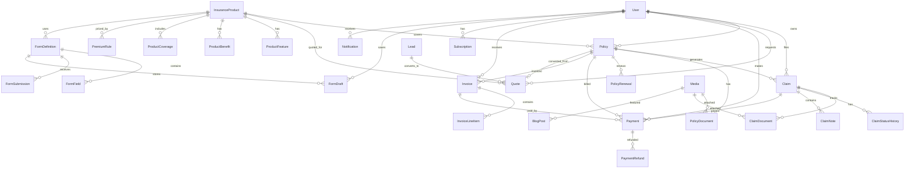
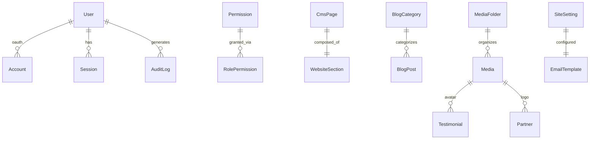

# Shiv Insurance Platform — Architecture

Enterprise insurance platform built on Next.js App Router with PostgreSQL, Prisma, NextAuth, Stripe, Cloudinary, and Resend.

---

## 1. System Overview

```
┌─────────────────────────────────────────────────────────────────────────────┐
│                           CLIENT LAYER                                       │
├──────────────────┬──────────────────┬───────────────────────────────────────┤
│  Public Website  │  Customer Portal │  Admin CMS                            │
│  (Marketing)     │  (/portal)       │  (/admin)                             │
└────────┬─────────┴────────┬─────────┴──────────────┬────────────────────────┘
         │                  │                        │
         ▼                  ▼                        ▼
┌─────────────────────────────────────────────────────────────────────────────┐
│                    NEXT.JS 15 APP ROUTER                                     │
│  ┌─────────────┐  ┌─────────────┐  ┌─────────────┐  ┌─────────────────┐   │
│  │ Server      │  │ API Routes  │  │ Middleware  │  │ Server Actions  │   │
│  │ Components  │  │ /api/*      │  │ Auth/RBAC   │  │ Form mutations  │   │
│  └─────────────┘  └─────────────┘  └─────────────┘  └─────────────────┘   │
└─────────────────────────────────────────────────────────────────────────────┘
         │                  │                        │
         ▼                  ▼                        ▼
┌─────────────────────────────────────────────────────────────────────────────┐
│                         SERVICE LAYER (src/lib)                              │
│  prisma · auth · stripe · cloudinary · resend · permissions · pdf          │
└─────────────────────────────────────────────────────────────────────────────┘
         │
         ▼
┌─────────────────────────────────────────────────────────────────────────────┐
│  PostgreSQL          Stripe API        Cloudinary CDN      Resend Email      │
└─────────────────────────────────────────────────────────────────────────────┘
```

---

## 2. Application Layers

### 2.1 Presentation Layer
| Zone | Route Prefix | Auth | Purpose |
|------|-------------|------|---------|
| Public | `/`, `/about`, `/products/*` | None | Marketing, SEO, lead capture |
| Customer Portal | `/portal/*` | Customer JWT | Policies, claims, payments |
| Admin CMS | `/admin/*` | Staff RBAC | Operations, content, reports |
| API | `/api/*` | Session/API key | REST endpoints, webhooks |

### 2.2 Business Domains
1. **Identity & Access** — Registration, login, roles, permissions
2. **Product Catalog** — 8 insurance product types with CMS-managed content
3. **Quoting & Underwriting** — Premium calculator, dynamic forms, quote lifecycle
4. **Policy Management** — Issuance, renewal, documents, lifecycle
5. **Claims Processing** — Submission, review workflow, payouts
6. **Billing & Payments** — Stripe checkout, subscriptions, invoices, refunds
7. **Content Management** — Pages, blog, FAQs, testimonials, website sections
8. **Lead Management** — Quote requests, contact forms, career applications

---

## 3. Authentication & Authorization

### 3.1 NextAuth v5 Flow
```
User → /login → Credentials Provider → bcrypt verify → JWT session
                                              ↓
                                    Role embedded in token
                                              ↓
                              Middleware guards /portal & /admin
```

### 3.2 Role-Based Access Control (RBAC)

| Role | Access Scope |
|------|-------------|
| **CUSTOMER** | Own policies, claims, payments, profile |
| **ADMIN** | Full system access |
| **MANAGER** | Users (view), policies, claims (review), CMS, leads, reports |
| **FINANCE** | Payments, invoices, refunds, financial reports |
| **CLAIMS_OFFICER** | Claims workflow, policy view (read-only) |

Permissions are defined in `src/lib/permissions.ts` and enforced at API route level via `hasPermission()`.

---

## 4. Entity Relationship Diagram (ERD)

### 4.1 Core Domain ERD



### 4.2 Auth & CMS ERD



### 4.3 Key Relationships Explained

| Relationship | Cardinality | Description |
|-------------|-------------|-------------|
| User → Policy | 1:N | Customer can hold multiple active policies |
| Policy → Claim | 1:N | Each claim tied to one policy |
| Quote → Policy | 1:1 | Accepted quote converts to single policy |
| InsuranceProduct → Policy | 1:N | Product template for all issued policies |
| FormDefinition → FormField | 1:N | Dynamic forms with conditional logic |
| Payment → PaymentRefund | 1:N | Partial or full refunds supported |
| Claim → ClaimStatusHistory | 1:N | Full audit trail of status changes |
| Lead → Quote | 1:N | Lead nurturing through quote funnel |

---

## 5. Data Flow Diagrams

### 5.1 Policy Purchase Flow
```
Visitor → Product Page → Premium Calculator → Application Form
    → Quote Created → Stripe Checkout → Webhook → Policy Activated
    → PDF Generated → Email Sent → Portal Access
```

### 5.2 Claims Workflow
```
Customer → File Claim (portal) → Status: SUBMITTED
    → Claims Officer Assigned → UNDER_REVIEW
    → Documents Requested (optional) → APPROVED/REJECTED
    → Payment Processed (if approved) → Status: PAID → CLOSED
```

### 5.3 Payment Flow
```
Checkout Request → Stripe Session → Customer Pays
    → Webhook (checkout.session.completed)
    → Payment record created → Invoice marked PAID
    → Policy status → ACTIVE → Notification sent
```

---

## 6. Technology Decisions

| Concern | Choice | Rationale |
|---------|--------|-----------|
| Framework | Next.js 15 App Router | SSR/SSG for SEO, API colocation, RSC |
| Database | PostgreSQL | ACID compliance, JSON support, scalability |
| ORM | Prisma | Type-safe queries, migrations, schema-first |
| Auth | NextAuth v5 | Industry standard, Prisma adapter, JWT |
| Payments | Stripe | Checkout, subscriptions, webhooks, refunds |
| Media | Cloudinary | CDN, transforms, secure uploads |
| Email | Resend | Transactional email, templates |
| UI | Shadcn + Tailwind | Accessible, customizable, consistent |
| Animation | Framer Motion | Page transitions, micro-interactions |
| Validation | Zod + React Hook Form | Runtime + form validation |

---

## 7. Security Architecture

- **Authentication**: bcrypt password hashing, JWT sessions, HTTP-only cookies
- **Authorization**: Role + permission checks on every protected API route
- **Input Validation**: Zod schemas on all API inputs
- **File Uploads**: Cloudinary signed uploads, MIME type validation, size limits
- **Payments**: Stripe webhook signature verification
- **Audit Trail**: AuditLog model tracks all admin mutations
- **Rate Limiting**: Recommended via middleware (Upstash Redis)
- **CSRF**: NextAuth built-in protection for auth routes

---

## 8. Scalability Considerations

1. **Database**: Indexed foreign keys, composite indexes on status+date queries
2. **Caching**: Redis for session store, ISR for public pages, product catalog cache
3. **File Storage**: Cloudinary CDN offloads media serving
4. **Background Jobs**: Queue for email, PDF generation, report exports (BullMQ/Inngest)
5. **Multi-tenancy Ready**: SiteSetting model supports white-label configuration
6. **API Versioning**: `/api/v1/*` namespace for future mobile apps

---

## 9. Deployment Architecture

```
┌──────────────┐     ┌──────────────┐     ┌──────────────┐
│   Vercel     │────▶│  PostgreSQL  │     │   Stripe     │
│  (Next.js)   │     │  (Neon/      │     │   Webhooks   │
│              │     │   Supabase)  │     └──────────────┘
└──────┬───────┘     └──────────────┘
       │
       ├────────────▶ Cloudinary (Media CDN)
       └────────────▶ Resend (Transactional Email)
```

---

## 10. Environment Variables

See `.env.example` for full list. Critical vars:
- `DATABASE_URL` — PostgreSQL connection
- `AUTH_SECRET` — NextAuth encryption key
- `STRIPE_*` — Payment processing
- `CLOUDINARY_*` — Media uploads
- `RESEND_API_KEY` — Email delivery

---

## 11. Development Workflow

```bash
# Install dependencies
npm install

# Configure environment
cp .env.example .env

# Run database migrations
npx prisma migrate dev

# Seed insurance products
npx prisma db seed

# Start development server
npm run dev
```

---

## 12. Module Map

| Module | Path | Responsibility |
|--------|------|----------------|
| Public pages | `src/app/(public)/` | Marketing website |
| Customer portal | `src/app/(portal)/portal/` | Authenticated customer area |
| Admin CMS | `src/app/(admin)/admin/` | Staff operations |
| API routes | `src/app/api/` | REST endpoints |
| Components | `src/components/` | Shared UI components |
| Services | `src/lib/` | Business logic & integrations |
| Types | `src/types/` | TypeScript definitions |
| Hooks | `src/hooks/` | React custom hooks |
| Validations | `src/validations/` | Zod schemas |

---

## 13. Premium Calculator Engine

See **[PREMIUM-CALCULATOR.md](./PREMIUM-CALCULATOR.md)** for the full design: versioned formula DSL, category field templates (Motor, Medical, Travel, Business, Home, Life), CMS admin at `/admin/premium-calculator`, calculation audit logs, and formula publish workflow.
